# SchoolPalm Message Delivery - Visual Architecture Diagrams

This document contains Mermaid diagrams showing the internal architecture, data flow, and relationships in the Message Delivery package.

## 1. System Architecture Overview

```mermaid
graph TD
    A["Application Code"] -->|MessageDelivery::sms()<br/>MessageDelivery::email()<br/>etc.| B["MessageDelivery Facade"]
    B -->|Instantiate| C["ChannelMessageBuilder<br/>or<br/>MultiChannelMessageBuilder"]
    C -->|call send| D["Message"]
    D -->|dispatch| E["MessageManager"]
    E -->|coordinate| F["DeliveryManager"]
    F -->|resolve channel| G["ChannelRegistry"]
    G -->|get| H["Channel Instance<br/>SMS/Email/Push/WhatsApp"]
    F -->|resolve provider| I["ProviderManager"]
    I -->|check config| J["TenantProviderSettings"]
    I -->|get provider| K["ProviderRegistry"]
    K -->|instantiate| L["MessageProvider<br/>EgoSMS/Twilio<br/>Firebase/Meta/etc."]
    H -->|execute| L
    L -->|call external API| M["External Service"]
    L -->|return| N["DeliveryResult"]
    N -->|dispatch event| E
    E -->|return| A
    style A fill:#e1f5ff
    style B fill:#fff3e0
    style D fill:#f3e5f5
    style N fill:#e8f5e9
```

## 2. Message Flow - Request to Delivery

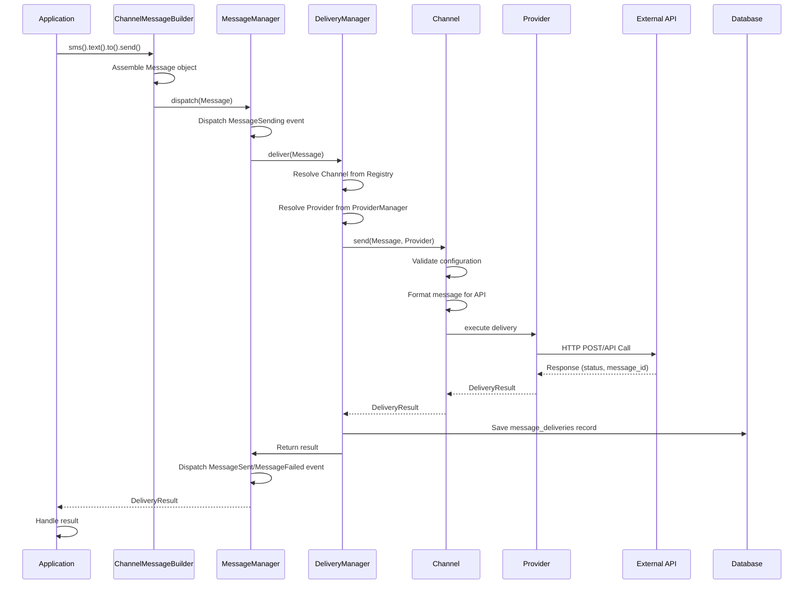

## 3. Builder Pattern - Method Chaining

```mermaid
graph LR
    A["MessageDelivery::sms()"] -->|ChannelMessageBuilder| B["text/view/template()"]
    B -->|return self| C["to()"]
    C -->|return self| D["with()"]
    D -->|return self| E["provider()"]
    E -->|return self| F["priority()"]
    F -->|return self| G["failover()"]
    G -->|return self| H["queue()"]
    H -->|return self| I["delay()"]
    I -->|return self| J["send()/queue()"]
    J -->|DeliveryResult| K["Application Result Handling"]
    style A fill:#fff3e0
    style J fill:#e8f5e9
    style K fill:#e1f5ff
```

## 4. Channel-Provider Relationship

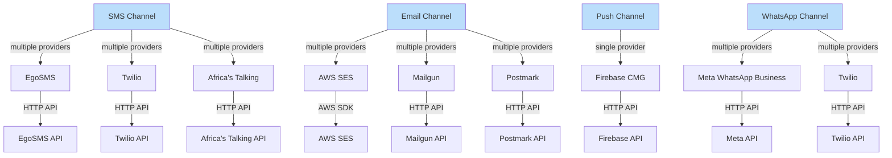

## 5. Dependency Injection & Service Container

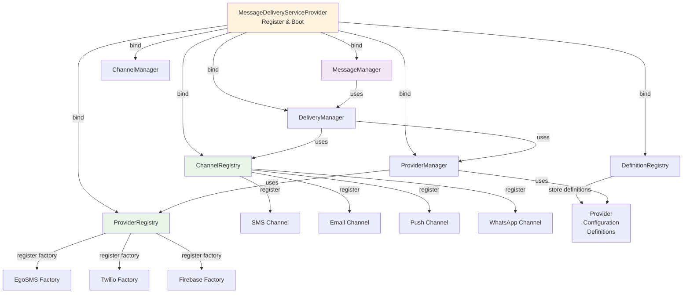

## 6. Message Data Object Structure

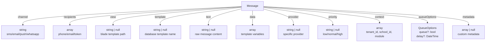

## 7. Provider Resolution Flow

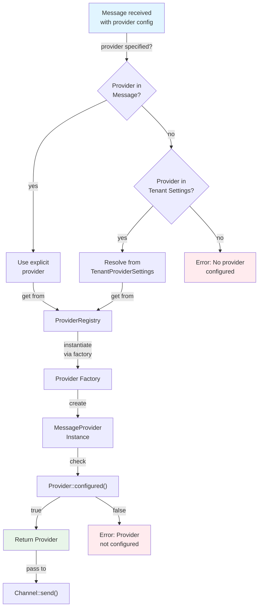

## 8. Event Lifecycle

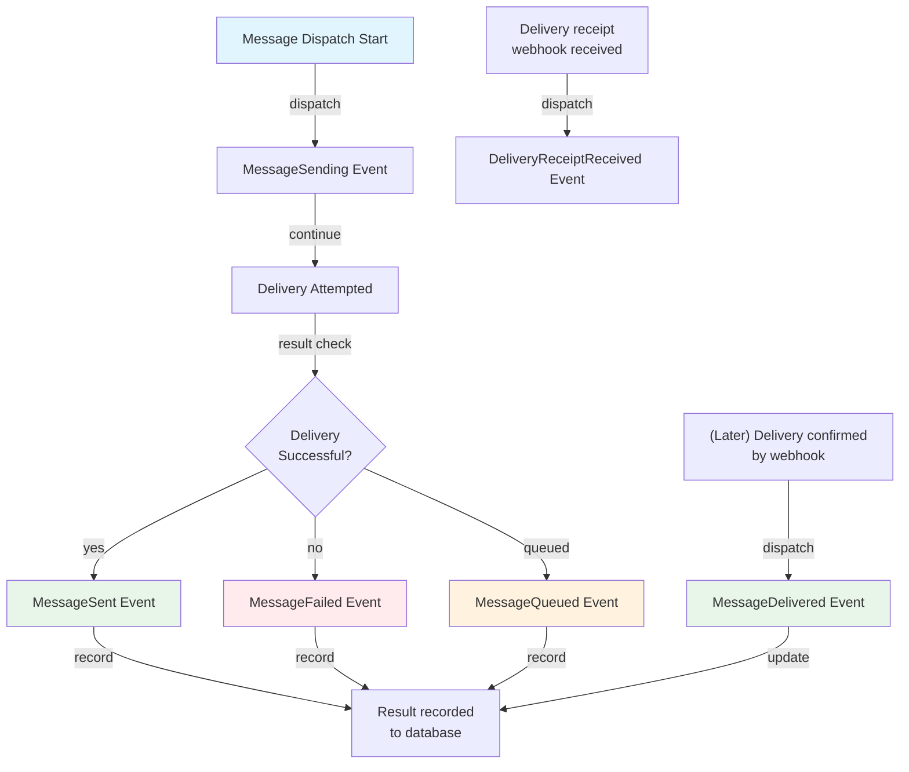

## 9. Multi-Channel Message Flow

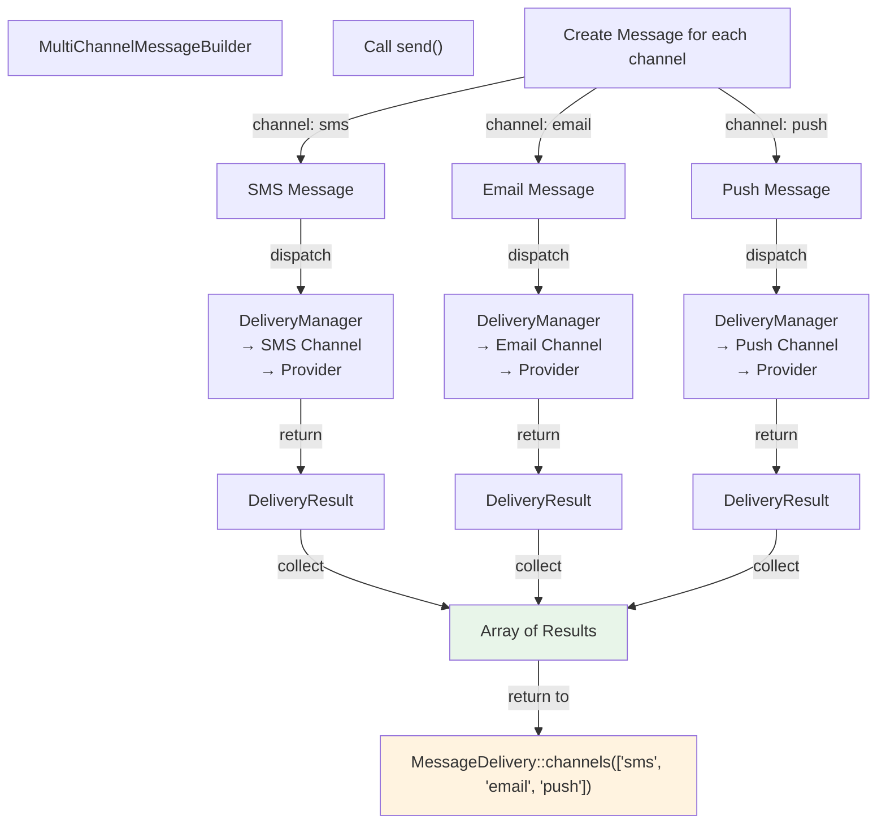

## 10. Queue & Retry Flow

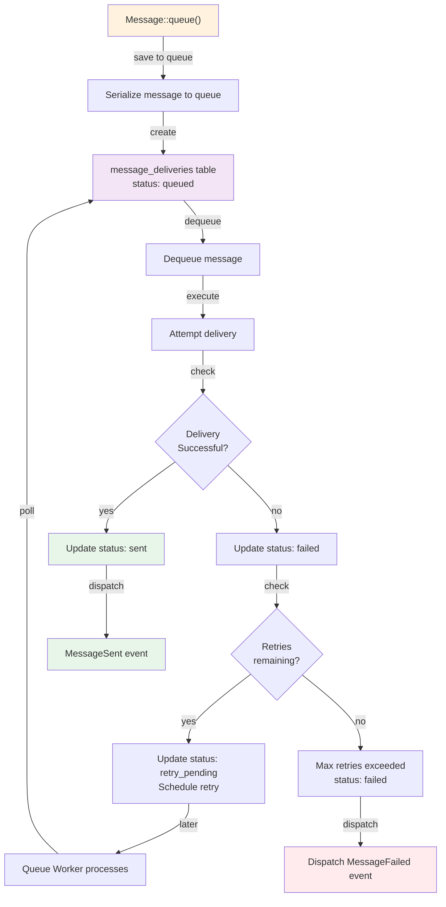

## 11. Context Propagation

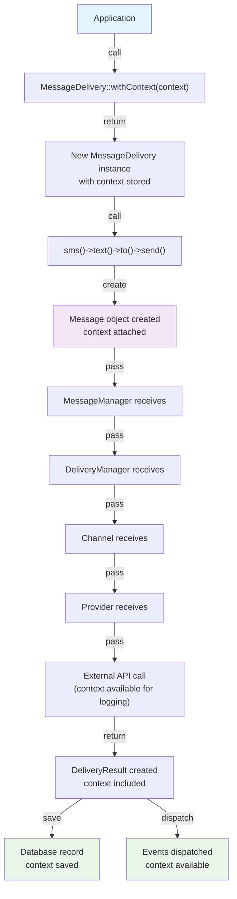

## 12. Extension Points - Custom Channel

```mermaid
graph TD
    A["Create Custom Channel"]
    B["Extend Channel abstract class"]
    C["Implement required methods:<br/>name(): string<br/>send(Message, Provider): DeliveryResult"]
    D["Register in ServiceProvider<br/>ChannelRegistry::register()"]
    E["Create Custom Provider<br/>Implement MessageProvider"]
    F["Register Provider Factory<br/>ProviderRegistry::register()"]
    G["User can now use:<br/>MessageDelivery::slack()->send()"]
    
    A -->|implement| B
    B -->|code| C
    C -->|boot()| D
    D -->|requires| E
    E -->|register| F
    F -->|enable| G
    
    style A fill:#fff3e0
    style G fill:#e8f5e9
    style D fill:#f3e5f5
```

## 13. Database Schema

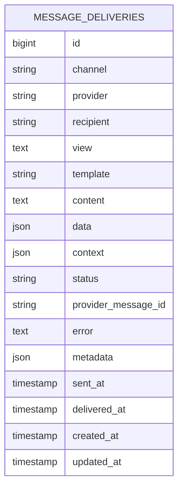

## 14. Status State Machine

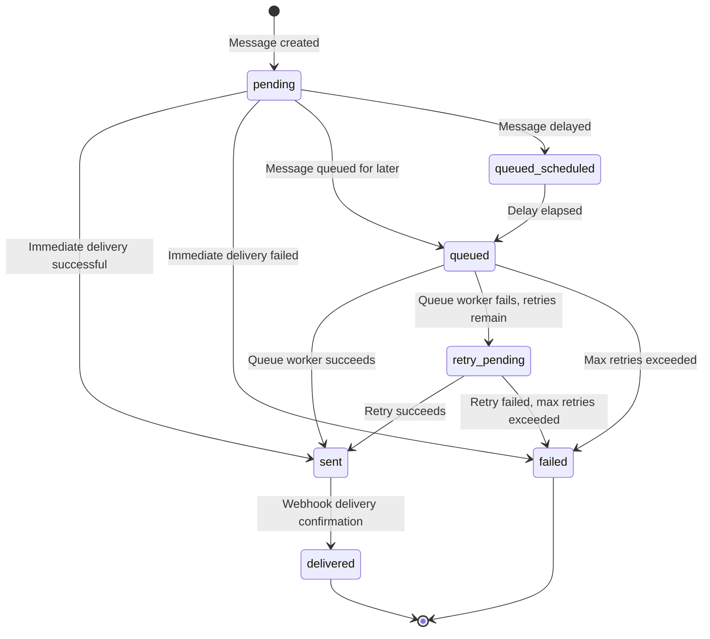

## 15. Configuration Resolution Hierarchy

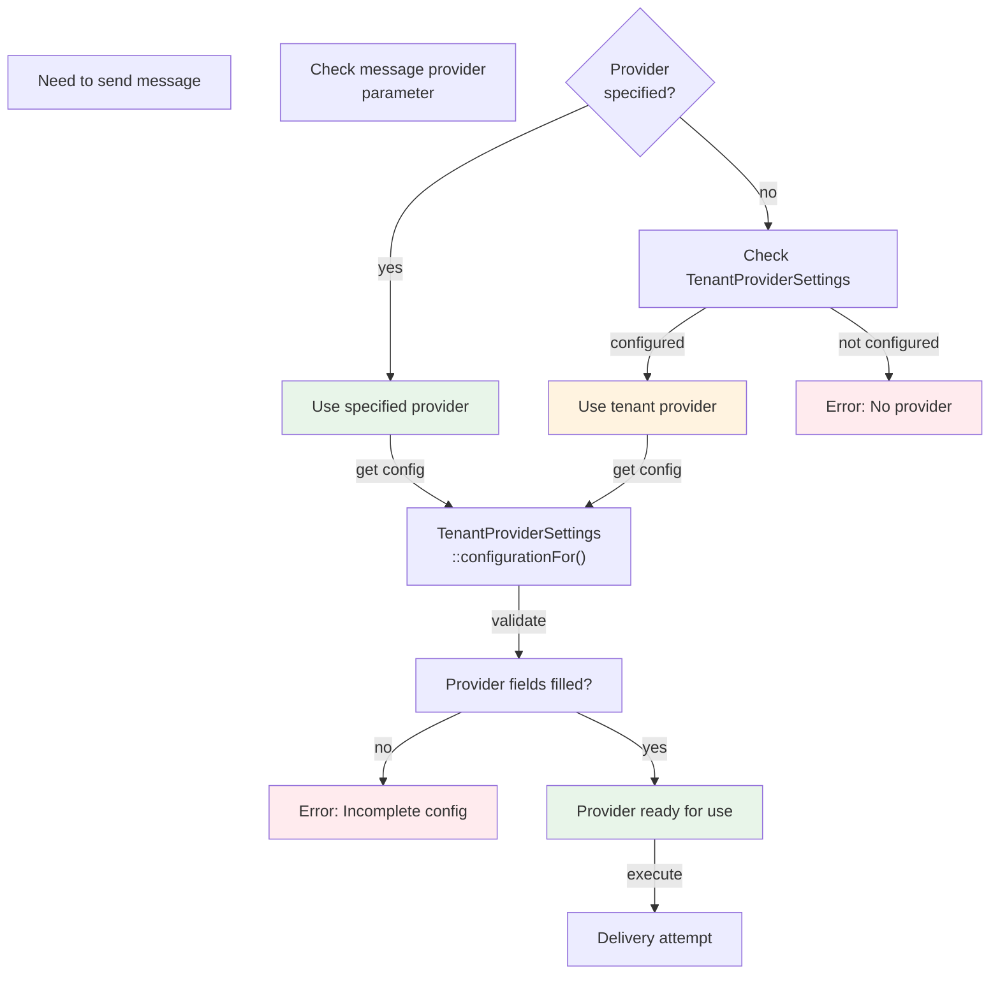

---

## Diagram Legend

- **Blue boxes** (`#e1f5ff`): Application entry points
- **Green boxes** (`#e8f5e9`): Success states / final results
- **Orange boxes** (`#fff3e0`): Configuration / Setup
- **Purple boxes** (`#f3e5f5`): Message / Data objects
- **Red boxes** (`#ffebee`): Error states
- **Rounded diamonds** (`{}`): Decision points
- **Arrows** (`→`, `-->`): Flow direction

---

## Using These Diagrams

1. **System Overview**: Start with Diagram #1 to understand the high-level architecture
2. **Message Flow**: See Diagram #2 for a sequence of how messages are delivered
3. **Builder Usage**: Reference Diagram #3 when learning the fluent API
4. **Channel-Provider Mapping**: Use Diagram #4 to understand which providers support which channels
5. **Provider Resolution**: Study Diagram #7 to understand how providers are selected
6. **Event System**: Review Diagram #8 to understand when events are dispatched
7. **Extending**: Check Diagrams #12 for custom channel/provider patterns
8. **Status Tracking**: Use Diagram #14 to understand message state transitions

