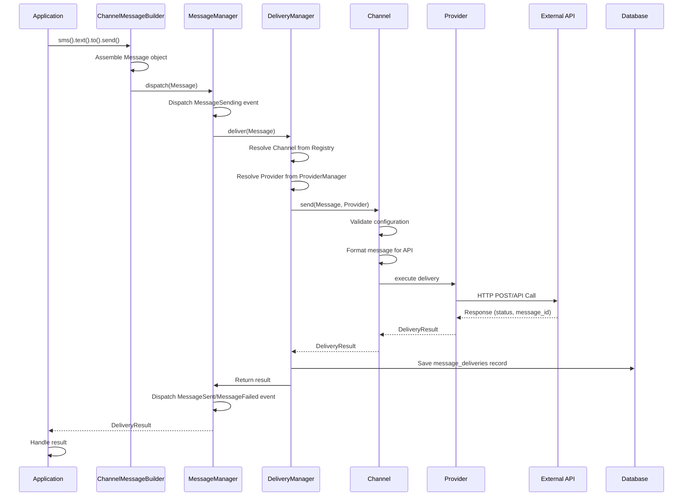
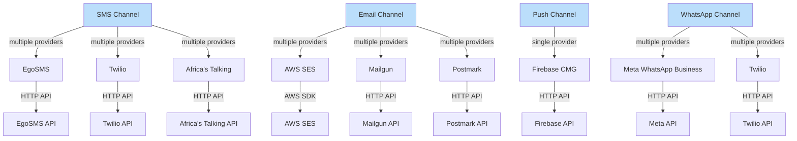
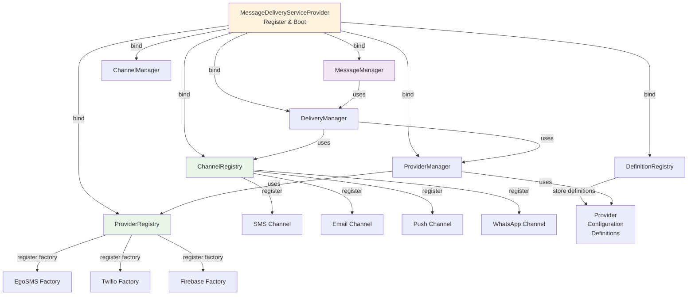

# SchoolPalm Message Delivery - Visual Architecture Diagrams

This document contains Mermaid diagrams showing the internal architecture, data flow, and relationships in the Message Delivery package.

## 1. System Architecture Overview

```mermaid
graph TD
    A["Application Code"] -->|MessageDelivery::sms()<br/>MessageDelivery::email()<br/>etc.| B["MessageDelivery Facade"]
    B -->|Instantiate| C["ChannelMessageBuilder<br/>or<br/>MultiChannelMessageBuilder"]
    C -->|call send| D["Message"]
    D -->|dispatch| E["MessageManager"]
    E -->|coordinate| F["DeliveryManager"]
    F -->|resolve channel| G["ChannelRegistry"]
    G -->|get| H["Channel Instance<br/>SMS/Email/Push/WhatsApp"]
    F -->|resolve provider| I["ProviderManager"]
    I -->|check config| J["TenantProviderSettings"]
    I -->|get provider| K["ProviderRegistry"]
    K -->|instantiate| L["MessageProvider<br/>EgoSMS/Twilio<br/>Firebase/Meta/etc."]
    H -->|execute| L
    L -->|call external API| M["External Service"]
    L -->|return| N["DeliveryResult"]
    N -->|dispatch event| E
    E -->|return| A
    style A fill:#e1f5ff
    style B fill:#fff3e0
    style D fill:#f3e5f5
    style N fill:#e8f5e9
```

## 2. Message Flow - Request to Delivery



## 3. Builder Pattern - Method Chaining

```mermaid
graph LR
    A["MessageDelivery::sms()"] -->|ChannelMessageBuilder| B["text/view/template()"]
    B -->|return self| C["to()"]
    C -->|return self| D["with()"]
    D -->|return self| E["provider()"]
    E -->|return self| F["priority()"]
    F -->|return self| G["failover()"]
    G -->|return self| H["queue()"]
    H -->|return self| I["delay()"]
    I -->|return self| J["send()/queue()"]
    J -->|DeliveryResult| K["Application Result Handling"]
    style A fill:#fff3e0
    style J fill:#e8f5e9
    style K fill:#e1f5ff
```



## 4. Channel-Provider Relationship



## 5. Dependency Injection & Service Container


